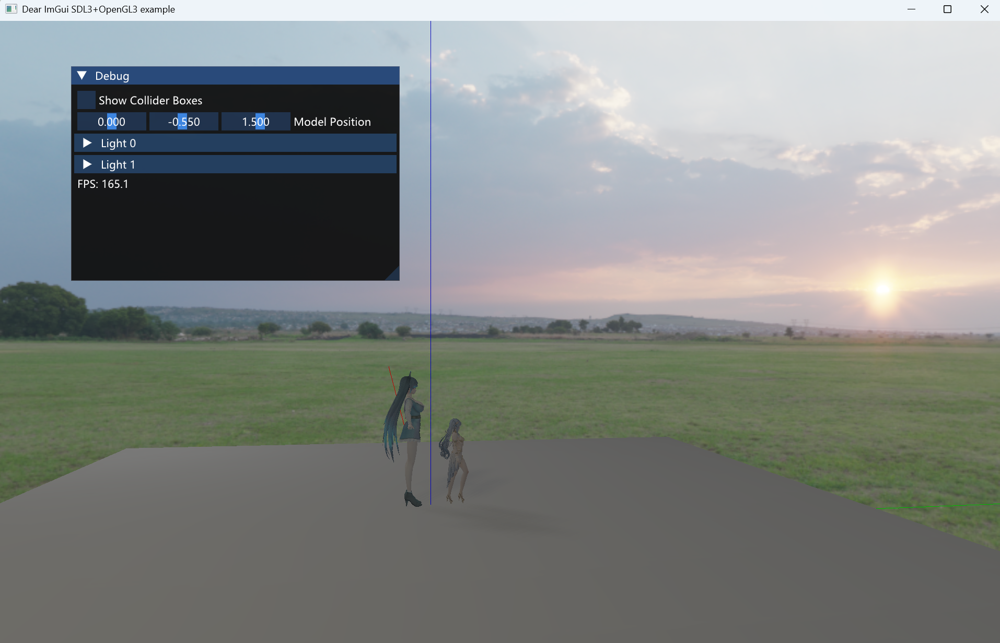
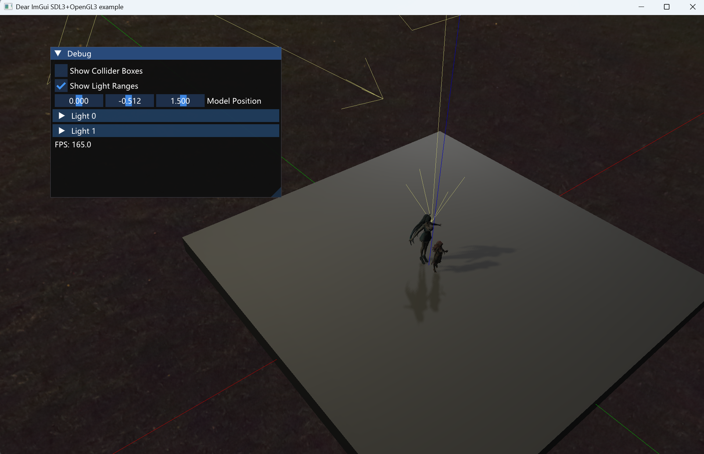
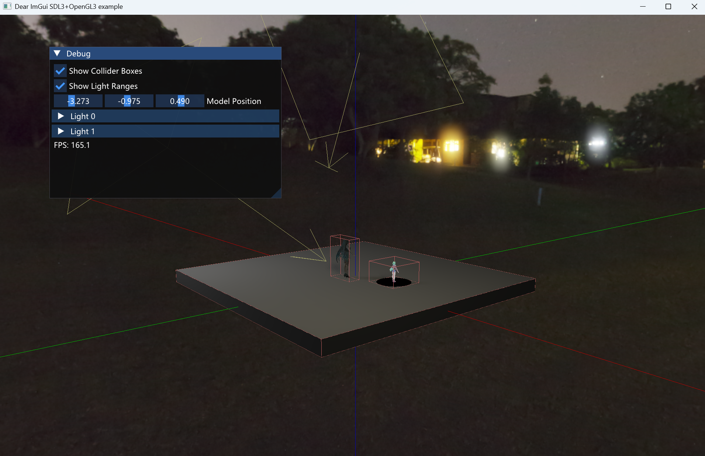
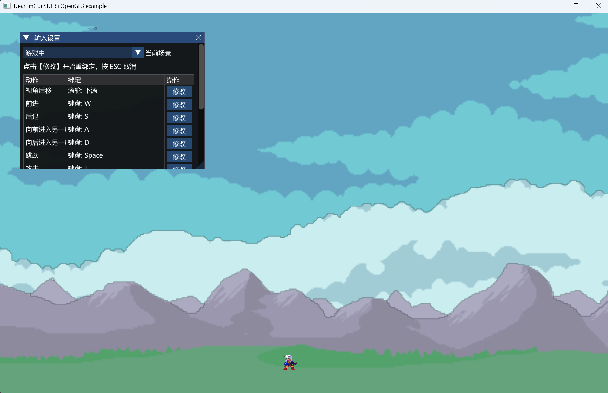

# SDL_IMGUI_OPENGL

基于 OpenGL 4.5 的实时 PBR 渲染引擎，使用 ECS 架构管理场景，支持 glTF 2.0 模型加载、多光源阴影、SSAO、Bloom 等后处理效果。

## 效果展示






## 特性

### 渲染

- Cook-Torrance PBR（GGX 法线分布、Smith 几何遮蔽、Schlick 菲涅尔）
- 金属度-粗糙度工作流
- 法线映射（TBN 正交化）
- HDR 渲染（RGBA16F 中间帧缓冲）
- 多光源支持（最多 8 盏，UBO 批量传输）
- 自发光 / 环境遮蔽纹理
- 等距柱状投影 HDR 天空盒
- MRT 多渲染目标（场景颜色 + 世界法线）

### 阴影

- 多光源阴影映射（Layered Depth Array，最多 8 层）
- PCF 5×5 软阴影
- 前向剔除缓解 Peter Panning
- 相机视锥体拟合光投影矩阵，优化阴影精度

### 后处理

- Bloom：4 级渐进式降采样 → 亮度提取 → 可分离高斯模糊 → 渐进式上采样叠加
- SSAO：64 采样半球核（UBO）+ 4×4 旋转噪声 + 深度重建视空间位置 + 范围检测 + 5×5 盒模糊
- Reinhard 色调映射
- Gamma 校正（1/2.2）

### 场景与 ECS

- 基于 EnTT 的实体-组件-系统架构
- 2D / 3D 变换组件，带脏标记的父子层级
- 2D 正交相机 / 3D 轨道相机（环绕、推拉、平移）
- 2D 精灵表动画系统
- 3D OBB 碰撞检测（SAT 15 轴测试）
- 2D AABB 网格碰撞

### 模型加载

- glTF 2.0：节点层级、TRS 变换、PBR 材质、坐标系转换（Y-up → Z-up）
- OBJ：顶点去重、材质提取、自动计算法线/切线
- Lengyel 切线计算算法

### 渲染管线

- 声明式渲染管线：每个 Pass 声明输入/输出（TextureSemantic），管线自动解析纹理依赖
- 纹理池：基于（语义, 级别）二元组索引，支持跨 Pass 纹理传递与多分辨率 Bloom
- 管线状态对象（PSO）：混合、深度、剔除、视口状态统一管理

### 资源管理

- 强类型资源 ID（TextureID / MeshID / ShaderID / FramebufferID），编译期防混用
- 名称 → ID 双向查找
- 统一生命周期管理

## 渲染管线流程

```
ShadowPass ──────────────────────────────────────────────────────┐
   │ 8层深度数组                                                    │
   ▼                                                               │
SkyboxPass ──► OpaquePass3D ──► TransparentPass3D ──► BloomBright │
   │               │                                      │       │
   │               │ PBR + 阴影采样                        │ 亮度提取│
   │               ▼                                      ▼       │
   │          SceneColor (HDR)                    BloomBlur ×4    │
   │          WorldNormal                         (H+V ping-pong) │
   │                                              BloomUp ×3      │
   │                                               │              │
   ▼                                               ▼              ▼
SSAO ──► SSAOBlur ──────────────────────► Composite ─────────────┘
                                          │ 色调映射 + Gamma
                                          ▼
                                       屏幕输出
```

## 架构概览

```
┌─────────────────────────────────────────────────────┐
│                     Application                      │
│  SDL3 窗口 · ImGui 调试面板 · 事件循环                │
├──────────────┬──────────────┬────────────────────────┤
│   Scene      │   Renderer   │   ResourceManager      │
│  EnTT ECS    │  管线构建     │  强类型 ID · 纹理/      │
│  组件/系统    │  UBO 管理     │  网格/着色器/帧缓冲    │
├──────────────┤              ├────────────────────────┤
│  Systems     │              │   ModelLoader           │
│  相机/灯光/   │              │  glTF 2.0 · OBJ        │
│  物理/动画    │              │  PBR 材质提取            │
├──────────────┴──────────────┴────────────────────────┤
│                  RenderPipeline                       │
│  Pass 有序执行 · 纹理池依赖解析 · PSO 状态管理         │
├──────────────────────────────────────────────────────┤
│  ShadowPass │ SkyboxPass │ OpaquePass │ PostProcess  │
│  深度数组    │ HDR 天空盒  │ PBR + 阴影  │ Bloom/SSAO  │
├──────────────────────────────────────────────────────┤
│              OpenGL 4.5 · GLEW                        │
└──────────────────────────────────────────────────────┘
```

## 项目结构

```
SDL_IMGUI_OPENGL/
├── SDL_IMGUI_OPENGL/            # 源码
│   ├── main.cpp                 # 入口：SDL3 初始化、主循环
│   ├── Renderer.h/cpp           # 渲染协调器：管线构建、UBO、提交
│   ├── RenderPipeline.h/cpp     # 管线执行引擎：Pass 调度、纹理池
│   ├── RenderPass.h             # Pass 抽象基类（声明式 I/O）
│   ├── PostProcessPass.h        # 后处理 Pass 基类（全屏四边形）
│   ├── ShadowPass.h/cpp         # 多光源阴影 Pass
│   ├── SkyboxPass.h/cpp         # HDR 天空盒 Pass
│   ├── OpaquePass3D.h/cpp       # 不透明 PBR Pass
│   ├── TransparentPass3D.h/cpp  # 透明物体 Pass
│   ├── OpaquePass2D.h/cpp       # 2D 不透明 Pass
│   ├── TransparentPass2D.h/cpp  # 2D 透明 Pass
│   ├── Framebuffer.h/cpp        # 帧缓冲封装（MRT、深度数组）
│   ├── TextureSemantic.h        # 纹理语义枚举与槽位映射
│   ├── PipelineUtils.h          # GL 状态捕获/应用/恢复
│   ├── DrawUtils.h/cpp          # 绘制调用引擎（排序、UBO 更新、Uniform 反射绑定）
│   ├── FullscreenQuad.h         # 全屏四边形绘制
│   ├── ResourceManager.h/cpp    # 资源注册中心（强类型 ID）
│   ├── Shader.h/cpp             # 着色器编译 + Uniform 反射
│   ├── Texture.h/cpp            # 纹理加载（标准/HDR/默认/噪声）
│   ├── Material.h               # 材质描述（着色器 + 纹理映射 + 自定义属性）
│   ├── ModelLoader.h/cpp        # glTF 2.0 / OBJ 模型加载
│   ├── mesh.h/cpp               # 网格数据
│   ├── VertexArray.h/cpp        # VAO 封装
│   ├── VertexBuffer.h/cpp       # VBO 封装
│   ├── IndexBuffer.h/cpp        # IBO 封装
│   ├── UniformBuffer.h/cpp      # UBO 封装（命名绑定点）
│   ├── Vertex.h                 # 顶点格式（2D / 3D / Line）
│   ├── GeometryUtils.h          # 法线/切线计算、坐标系转换、条带展开
│   ├── OBB.h                    # 有向包围盒 + SAT 碰撞检测
│   ├── Scene.h                  # 场景抽象基类
│   ├── BattleScene.h/cpp        # 2D 战斗场景
│   ├── StoryScene.h/cpp         # 3D 展示场景（glTF 查看器）
│   ├── SceneManager.h/cpp       # 场景管理器
│   ├── EntityFactory.h/cpp      # 实体工厂（相机/灯光/模型/玩家）
│   ├── ComTransform.h           # 变换组件（2D/3D，脏标记层级）
│   ├── ComCamera.h              # 相机组件（正交/透视轨道）
│   ├── ComLight.h/cpp           # 灯光组件（阴影层、视锥拟合）
│   ├── ComRender.h              # 渲染组件（可见性/模型/动画精灵）
│   ├── ComPhysics.h             # 物理组件（2D AABB / 3D OBB）
│   ├── ComGameplay.h            # 游戏逻辑组件（玩家状态机/标签/销毁）
│   ├── Systems.cpp              # 系统：相机/渲染提交/玩家/动画/层级/灯光/销毁
│   ├── PhysicsSystem.h/cpp      # 物理：2D 网格碰撞 / 3D SAT 碰撞
│   ├── DebugRenderSystem.h      # 调试渲染（OBB 线框）
│   ├── InputManager.h/cpp       # 输入管理
│   ├── GameSettings.h/cpp       # 游戏设置
│   ├── Map.h/cpp                # 2D 地图系统
│   ├── HierarchyUtils.h         # 层级脏标记传播
│   ├── *.glsl                   # 14 个着色器文件
│   └── resources/               # 模型、纹理、HDR 天空盒资源
├── 扩展库/                       # 第三方依赖
│   ├── SDL3/                    # 窗口与输入
│   ├── GLEW/                    # OpenGL 扩展加载
│   ├── glm/                     # 数学库
│   ├── imgui/                   # Dear ImGui（SDL3 + OpenGL3 后端）
│   └── entt/                    # 实体-组件-系统框架
└── SDL_IMGUI_OPENGL.slnx        # Visual Studio 解决方案
```

## 着色器

| 着色器 | 用途 |
|--------|------|
| Shader3D.glsl | PBR 核心：Cook-Torrance BRDF、法线映射、多光源、PCF 阴影采样、MRT 输出 |
| ShaderShadow.glsl | 阴影深度 Pass |
| ShaderSkybox.glsl | 等距柱状 HDR 天空盒 |
| ShaderBloomBright.glsl | Bloom 亮度提取 |
| ShaderBloomBlur.glsl | Bloom 可分离高斯模糊 |
| ShaderBloomUp.glsl | Bloom 渐进式上采样叠加 |
| ShaderSSAO.glsl | SSAO：深度重建视空间位置、半球采样、范围检测 |
| ShaderSSAOBlur.glsl | SSAO 5×5 盒模糊 |
| ShaderComposite.glsl | 最终合成：SSAO 遮蔽 + Bloom 叠加 + Reinhard 色调映射 + Gamma 校正 |
| Shader.glsl / Shader2.glsl / Shader3.glsl | 2D 精灵着色器（不透明/透明裁剪变体） |
| ShaderLine.glsl | 调试线框渲染 |
| ShaderPostProcess.glsl | 通用后处理通道 |

## 依赖

| 库 | 用途 |
|----|------|
| SDL3 | 窗口创建、输入处理、OpenGL 上下文 |
| GLEW | OpenGL 扩展加载 |
| GLM | 向量/矩阵数学 |
| Dear ImGui | 运行时调试面板 |
| EnTT | 实体-组件-系统框架 |
| TinyGLTF | glTF 2.0 模型加载 |
| tinyobjloader | OBJ 模型加载 |
| stb_image | 图片加载（PNG/JPG/HDR） |

## 构建

项目使用 Visual Studio 2022 构建，需确保：

1. 扩展库路径 `扩展库/` 下包含 SDL3、GLEW、GLM、ImGui、EnTT
2. SDL3 DLL 需在可执行文件同目录或系统 PATH 中
3. OpenGL 4.5 兼容显卡

```
打开 SDL_IMGUI_OPENGL.slnx → x64 Release → 生成
```

## 技术要点

### 声明式渲染管线

每个 RenderPass 通过 `DeclareInput` / `DeclareOutput` 声明纹理依赖，RenderPipeline::Execute 自动从纹理池解析输入、注册输出，实现 Pass 间数据流的自动衔接。

**设计动机**：原始管线硬编码在 `Renderer::Flush()` 中，添加后处理效果需手动管理中间纹理和绑定顺序。重构后新增 Bloom/SSAO 仅需编写 Pass 类并注册到管线，依赖自动解析。

### 纹理池 (语义, 级别) 二元组索引

纹理池使用 `(TextureSemantic, Level)` 二元组作为键，而非单一语义 ID。

**设计动机**：Bloom 需要同一语义（BloomResult）的 4 个不同分辨率版本共存。单一语义 ID 会冲突，二元组索引天然区分分辨率层级，避免为每个分辨率创建新语义枚举。

### 阴影视锥体拟合

对每盏光源，从相机 VP 矩阵逆推视锥体 8 个角点，反向投影到光源空间，取最小/最大包围盒构建光投影矩阵。

**设计动机**：固定 ortho(-10,10) 在场景规模变化时浪费阴影贴图分辨率——场景小时覆盖多余空间，场景大时阴影被裁切。动态拟合确保阴影贴图像素始终覆盖相机可见区域，精度最大化。

### 多级 Bloom 实现

4 级降采样（1/2 → 1/4 → 1/8 → 1/16），每级：亮度提取 → 水平高斯模糊 → 垂直高斯模糊（ping-pong FBO），3 级渐进上采样叠加回高分辨率。

**设计动机**：单级模糊无法产生大范围辉光。直接在原分辨率做大半径模糊的采样数随半径平方增长。多级降采样 + 可分离高斯模糊将 2D 卷积 O(N²) 降为两次 1D O(2N)，每级降采样进一步减少像素数。

### SSAO 实现

深度缓冲逆投影重建视空间位置，dFdx/dFdy 计算视空间法线，64 采样半球核（UBO 传输）+ 4×4 旋转噪声打破带状伪影，范围检测避免远处误遮挡，5×5 盒模糊降噪。

**设计动机**：SSAO 采样核最初用 uniform 数组存储，但 64 个 vec3 = 192 个 float，多数 GPU 驱动只保证 256 个 vec4 的 uniform 容量，极易超限。改为 UBO (binding=3) 传输，容量无忧且与 shadow UBO 统一管理。

### 强类型资源 ID

TextureID / MeshID / ShaderID / FramebufferID 均为独立结构体，`static_assert` 确保编译期不可混用，提供自定义 hash 支持 `unordered_map`。

**设计动机**：OpenGL 原生用 GLuint 标识所有资源，编译期不区分纹理/着色器/帧缓冲类型，参数传递时容易混淆。封装为独立类型后，类型错误在编译期拦截，避免运行时难以排查的 GL 状态错误。

### HDR 管线策略

色调映射从各 shader 中移除，统一到最终 Composite Pass 执行。中间 Pass 全部使用 RGBA16F 帧缓冲保留 HDR 值。

**设计动机**：原始管线的色调映射分散在 Shader3D、Skybox 等 pass 中，传入后处理的颜色已被截断到 [0,1]，导致 Bloom 亮度提取失效。统一到 Composite Pass 后，Bloom 可从原始 HDR 值正确提取高亮区域。

---

## 设计决策记录

以下是开发过程中遇到的关键问题和技术决策：

| # | 问题 | 方案 | 收益 |
|---|------|------|------|
| 1 | 硬编码管线难以扩展后处理 | 声明式 Pass + 纹理池依赖解析 | 新增 SSAO 仅加 3 行管线注册代码 |
| 2 | Bloom 多分辨率纹理命名冲突 | (语义, 级别) 二元组索引 | 同一语义多分辨率共存，无需新增枚举 |
| 3 | SSAO 采样核超过 uniform 上限 | UBO (binding=3) 传输半球核 | 突破 uniform 数量限制，与 shadow UBO 统一管理 |
| 4 | 固定阴影投影浪费分辨率 | 相机视锥体 8 角 → 光空间包围盒 | 阴影精度随场景自适应，像素利用率最大化 |
| 5 | 各 shader 分散做色调映射截断 HDR | 色调映射移至 Composite Pass | Bloom 从原始 HDR 值正确提取亮区 |
| 6 | 阴影硬边缘锯齿严重 | 5×5 PCF + GL_LINEAR 双线性插值 | 软阴影过渡自然，采样数可控 |

---

## 深度文档

- [项目流程架构详解](docs/PROJECT_ARCHITECTURE.md) — 从启动到一帧渲染的完整数据流
- [3D 渲染 Pass 深度解析](docs/RENDERING_PASS_GUIDE.md) — 每个 Pass 的理论基础与实现细节
- [周开发任务清单](docs/FUTURE_ARCHITECTURE.md)

## 许可

本项目为个人学习项目，欢迎一起学习。
